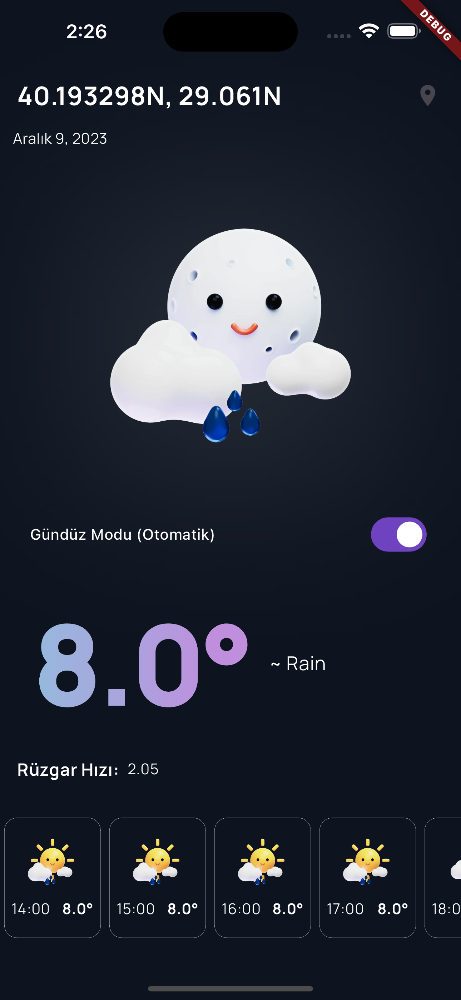

# Flutter Weatherapp

 

## Getting Started

Firstly load packages;

     flutter pub get

## Debug on emulators
IOS emulators can not detect location from services. For testing; 

     - open `lib>layout` folder,
     - select `layout_mobile.dart`,
     - Line 106;
          from:
          `await _getLocation()`
          to:
          `//await _getLocation()`
          
For emulator debug;

     flutter run

Then select Emulator.

## Debug on real device
For real device test. Connect with your phone. If android don't forget open developer mode.

     flutter run --profile

## Debug on Web
Close flutter sdk WEB securities. Then run this code;

     flutter run -d chrome --web-renderer html --web-port 8080
